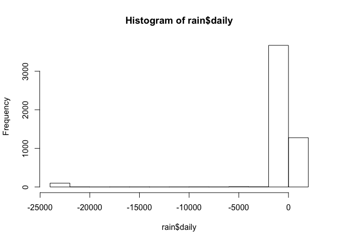
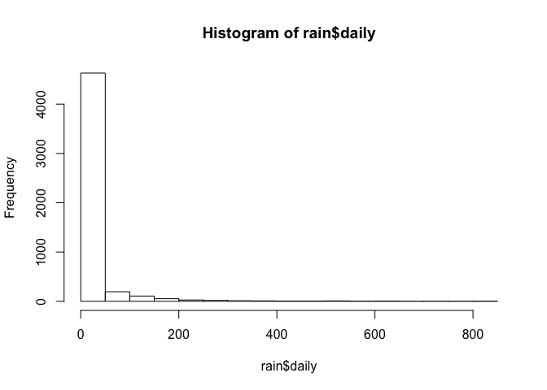

# hw

1. The data set at [http://www.stats.uwo.ca/faculty/braun/data/rnf6080.dat] records hourly rainfall at a certain location in Canada, every day from 1960 to 1980.
    a. First, we need to load the data set into R using the command `read.table()`. Use the help function to learn what arguments this function takes. Once you have the necessary input, load the data set into R and make it a data frame called `rain.df`.

```r
rain <- read.table('http://www.stats.uwo.ca/faculty/braun/data/rnf6080.dat')
```
    b. How many rows and columns does `rain.df` have? (If there are not 5070 rows and 27 columns, something is wrong; check the previous part to see what might have gone wrong in the previous part.)

```r
nrow(rain)
```

```
## [1] 5070
```

```r
ncol(rain)
```

```
## [1] 27
```

    c. What are the names of the columns of `rain.df`?
v1-v27


    d. What is the value of row 5, column 7 of `rain.df`?

```r
rain[5,7]
```

```
## [1] 0
```

    e. Display the second row of `rain.df` in its entirety.

```r
rain[2,]
```

```
##   V1 V2 V3 V4 V5 V6 V7 V8 V9 V10 V11 V12 V13 V14 V15 V16 V17 V18 V19 V20
## 2 60  4  2  0  0  0  0  0  0   0   0   0   0   0   0   0   0   0   0   0
##   V21 V22 V23 V24 V25 V26 V27
## 2   0   0   0   0   0   0   0
```

    f. Explain what this command does:

```r
names(rain) <- c("year","month","day",seq(0,23))
```
by running it on your data and examining the object. (You may find the display functions `head()` and `tail()` useful here.) Is it clear now what the last 24 columns represent?

//names the columns. last 24 are the hour

    g. Create a new column in the data frame called `daily`, which is the sum of the rightmost 24 columns. With this column, create a histogram of the values in this column, which are supposed to be daily rainfall values. What is wrong with this picture?  

```r
rain$daily = apply(rain[,4:27], 1, sum)
hist(rain$daily)
```

 
//negative rail fall?


h. Create a new data frame `rain.df.fixed` that takes the original and fixes it for the apparent flaw you have discovered. Having done this, produce a new histogram with the corrected data and explain why this is more reasonable.

```r
rain[rain < 0] <- 0
rain$daily = apply(rain[,4:27], 1, sum)
hist(rain$daily)
```

 


//Throws out negitive values

2. Syntax and class-typing.
    a. For each of the following commands, either explain why they should be errors, or explain the non-erroneous result.

```
vector1 <- c("5", "12", "7", "32")
max(vector1)
sort(vector1)
sum(vector1)
```
//can't sum characters

    b. For the next series of commands, either explain their results, or why they should produce errors.

```
vector2 <- c("5",7,12)
vector2[2] + vector2[3]
#numbers get cast as characters, which can't be added

dataframe3 <- data.frame(z1="5",z2=7,z3=12)
dataframe3[1,2] + dataframe3[1,3]
#19 - dataframes can have different types

list4 <- list(z1="6", z2=42, z3="49", z4=126)
list4[[2]]+list4[[4]]  #168 - lists can have different types
list4[2]+list4[4]  #single brackets give back a list which can't be added
```

3. Working with functions and operators.
    a. The colon operator will create a sequence of integers in order. It is a special case of the function `seq()` which you saw earlier in this assignment. Using the help command `?seq` to learn about the function, design an expression that will give you the sequence of numbers from 1 to 10000 in increments of 372.

```r
    seq(from=1, to=10000, by=372)
```

```
##  [1]    1  373  745 1117 1489 1861 2233 2605 2977 3349 3721 4093 4465 4837
## [15] 5209 5581 5953 6325 6697 7069 7441 7813 8185 8557 8929 9301 9673
```
    
Design another that will give you a sequence between 1 and 10000 that is exactly 50 numbers in length.

```r
seq(from=1, to=10000, length.out=50)
```

```
##  [1]     1.0000   205.0612   409.1224   613.1837   817.2449  1021.3061
##  [7]  1225.3673  1429.4286  1633.4898  1837.5510  2041.6122  2245.6735
## [13]  2449.7347  2653.7959  2857.8571  3061.9184  3265.9796  3470.0408
## [19]  3674.1020  3878.1633  4082.2245  4286.2857  4490.3469  4694.4082
## [25]  4898.4694  5102.5306  5306.5918  5510.6531  5714.7143  5918.7755
## [31]  6122.8367  6326.8980  6530.9592  6735.0204  6939.0816  7143.1429
## [37]  7347.2041  7551.2653  7755.3265  7959.3878  8163.4490  8367.5102
## [43]  8571.5714  8775.6327  8979.6939  9183.7551  9387.8163  9591.8776
## [49]  9795.9388 10000.0000
```

    b. The function `rep()` repeats a vector some number of times. Explain the difference between `rep(1:3, times=3) and rep(1:3, each=3).
    
    #times repeats c(1, 2, 3) 3 times, each 1 1 1 2 2 2 3 3 3
