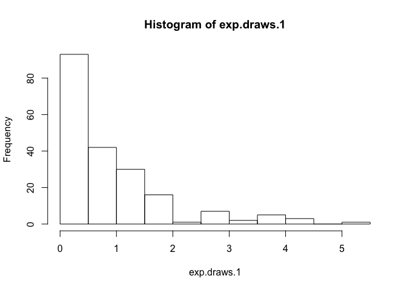
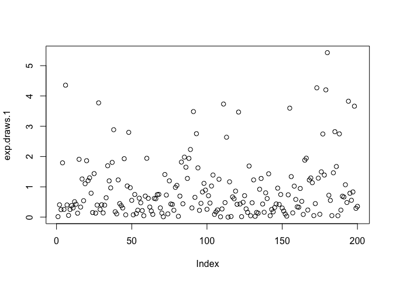
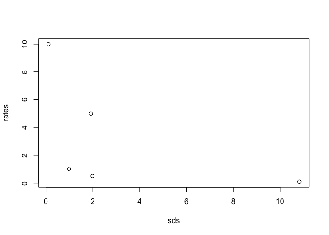
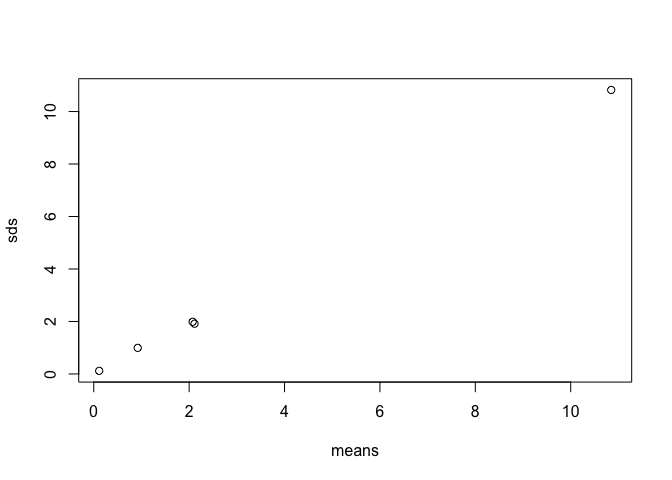
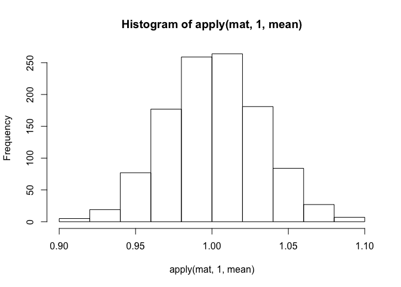

# lab

#Part I

Generate 200 random values from the standard exponential distribution and store them in a vector
exp.draws.1.

```r
exp.draws.1 <- rexp(n=200)
```

Find the mean and sd

```r
mean(exp.draws.1)
```

```
## [1] 0.9215763
```

```r
sd(exp.draws.1)
```

```
## [1] 0.9940164
```

Repeat, but change the rate to 0.1, 0.5, 5 and 10, storing the results in vectors called exp.draws.0.1,
exp.draws.0.5, exp.draws.5 and exp.draws.10.

```r
exp.draws.0.1 <- rexp(n=200, rate=.1)
exp.draws.0.5 <- rexp(n=200, rate=.5)
exp.draws.5 <- rexp(n=200, rate=.5)
exp.draws.10 <- rexp(n=200, rate=10)
```


Use the hist() function to produce a histogram of your standard exponential distribution

```r
hist(exp.draws.1)
```

 

```r
plot(exp.draws.1)
```

 

```r
plot(exp.draws.1, exp.draws.10)
```

 

a. The five means versus the five rates used to generate the distribution.

```r
rates = c(.1, .5, 1, 5, 10)
means = c(mean(exp.draws.0.1), mean(exp.draws.0.5), mean(exp.draws.1), mean(exp.draws.5), mean(exp.draws.10))
sds = c(sd(exp.draws.0.1), sd(exp.draws.0.5), sd(exp.draws.1), sd(exp.draws.5), sd(exp.draws.10))


plot(means, rates)
```

 
b. The standard deviations versus the rates.

```r
plot(sds, rates)
```

 

c. The means versus the standard deviations.

```r
plot(means, sds)
```

 

#Part II

 generate 1.1 million numbers from the standard exponential distribution and store
them in a vector called big.exp.draws.1.

```r
draws <- rexp(n=1100000)
mean(draws)
```

```
## [1] 1.001128
```

```r
sd(draws)
```

```
## [1] 1.000575
```

```r
hist(draws)
```

 


Find the mean of all of the entries in big.exp.draws.1 which are strictly greater than 1

```r
mean(which(draws > 1))
```

```
## [1] 550009.1
```

Create a matrix, big.exp.draws.1.mat, containing the the values in big.exp.draws.1, with 1100 rows and 1000 columns.

```r
mat <- matrix(draws, nrow=1100)
```

Calculate the mean of the 371st column of big.exp.draws.1.mat.

```r
mean(mat[,371])
```

```
## [1] 1.05683
```

f. Now, find the means of all 1000 columns of big.exp.draws.1.mat simultaneously. Plot the
histogram of column means. Explain why its shape does not match the histogram in problem 5b).

```r
hist(apply(mat, 1, mean))
```

 

g. Take the square of each number in big.exp.draws.1, and find the mean of this new vector.
Explain this in terms of the mean and standard deviation of big.exp.draws.1. Hint: think
carefully about the formula R uses to calculate the standard deviation.

```r
mean(draws*draws)
```

```
## [1] 2.003408
```
