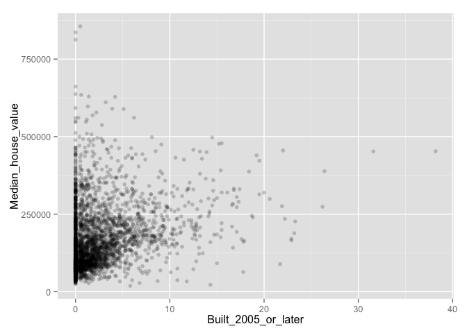
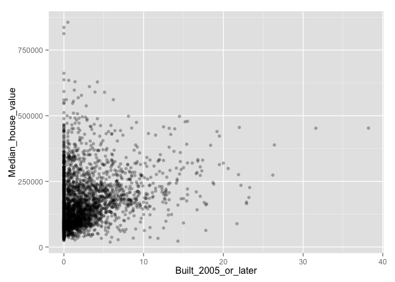
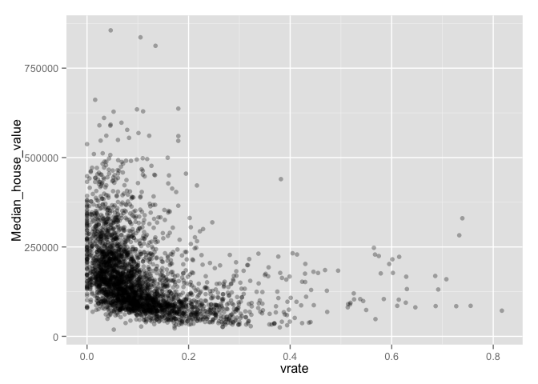

# hw

The data set at [http://www.stat.cmu.edu/~cshalizi/uADA/13/hw/01/calif_penn_2011.csv] contains information about the housing stock of California and Pennsylvania, as of 2011.  Information as aggregated into "Census tracts", geographic regions of a few thousand people which are supposed to be fairly homogeneous economically and socially.

_General hint_: See Recipes 10.1 and 10.2 in _The R Cookbook_ for making scatterplots.

1. _Loading and cleaning_
    a. Load the data into a dataframe called `ca_pa`.
    b. How many rows and columns does the dataframe have?
    c. Run this command, and explain, in words, what this does:

```
colSums(apply(ca_pa,c(1,2),is.na))
```
    d. The function `na.omit()` takes a dataframe and returns a new dataframe, omitting any row containing an NA value.  Use it to purge the data set of rows with incomplete data.
    e. How many rows did this eliminate?
    f. Are your answers in (c) and (e) compatible? Explain.


```r
ca_pa <- read.csv('http://www.stat.cmu.edu/~cshalizi/uADA/13/hw/01/calif_penn_2011.csv')

nrow(ca_pa)
```

```
## [1] 11275
```

```r
ncol(ca_pa)
```

```
## [1] 34
```

```r
#counts the number of NAs in each column
colSums(apply(ca_pa,c(1,2),is.na))
```

```
##                           X                     GEO.id2 
##                           0                           0 
##                     STATEFP                    COUNTYFP 
##                           0                           0 
##                     TRACTCE                  POPULATION 
##                           0                           0 
##                    LATITUDE                   LONGITUDE 
##                           0                           0 
##           GEO.display.label          Median_house_value 
##                           0                         599 
##                 Total_units                Vacant_units 
##                           0                           0 
##                Median_rooms  Mean_household_size_owners 
##                         157                         215 
## Mean_household_size_renters         Built_2005_or_later 
##                         152                          98 
##          Built_2000_to_2004                 Built_1990s 
##                          98                          98 
##                 Built_1980s                 Built_1970s 
##                          98                          98 
##                 Built_1960s                 Built_1950s 
##                          98                          98 
##                 Built_1940s       Built_1939_or_earlier 
##                          98                          98 
##                  Bedrooms_0                  Bedrooms_1 
##                          98                          98 
##                  Bedrooms_2                  Bedrooms_3 
##                          98                          98 
##                  Bedrooms_4          Bedrooms_5_or_more 
##                          98                          98 
##                      Owners                     Renters 
##                         100                         100 
##     Median_household_income       Mean_household_income 
##                         115                         126
```

```r
nna <- na.omit(ca_pa)
nrow(nna)
```

```
## [1] 10605
```

```r
nrow(nna) - ncol(ca_pa)
```

```
## [1] 10571
```

```r
#results are compatible - a given row with an NA could have one or many 
```


2. _This Very New House_  
    a. The variable `Built_2005_or_later` indicates the percentage of houses in each Census tract built since 2005.  Plot median house prices against this variable.
    b. Make a new plot, or pair of plots, which breaks this out by state.  Note that the state is recorded in the `STATEFP` variable, with California being state 6 and Pennsylvania state 42.
    

```r
library(ggplot2)
library(dplyr)
```

```
## 
## Attaching package: 'dplyr'
## 
## The following object is masked from 'package:stats':
## 
##     filter
## 
## The following objects are masked from 'package:base':
## 
##     intersect, setdiff, setequal, union
```

```r
nna %>% filter(STATEFP != 6)  %>% ggplot(aes(Built_2005_or_later, Median_house_value)) + geom_point(alpha=.2)
```

 

```r
nna %>% filter(STATEFP != 6)  %>% ggplot(aes(Built_2005_or_later, Median_house_value)) + geom_point(alpha=.3)
```

 

3. _Nobody Home_  
The vacancy rate is the fraction of housing units which are not occupied.  The dataframe contains columns giving the total number of housing units for each Census tract, and the number of vacant housing units.  
    a. Add a new column to the dataframe which contains the vacancy rate.  What are the minimum, maximum, mean, and median vacancy rates?
    b. Plot the vacancy rate against median house value.
    c. Plot vacancy rate against median house value separately for California and for Pennsylvania.  Is there a difference?
    

```r
nna$vrate <- nna$Vacant_units/nna$Total_units
summary(nna$vrate)
```

```
##    Min. 1st Qu.  Median    Mean 3rd Qu.    Max. 
## 0.00000 0.03846 0.06767 0.08889 0.10920 0.96530
```

```r
nna %>% filter(STATEFP != 6)  %>% ggplot(aes(vrate, Median_house_value)) + geom_point(alpha=.2)
```

 

```r
nna %>% filter(STATEFP != 6)  %>% ggplot(aes(vrate, Median_house_value)) + geom_point(alpha=.3)
```

 
    
4. The column `COUNTYFP` contains a numerical code for counties within each state.  We are interested in Alameda County (county 1 in California), Santa Clara (county 85 in California), and Allegheny County (county 3 in Pennsylvania).
    a. Explain what the block of code at the end of this question is supposed to accomplish, and how it does it.
    b. Give a single line of R which gives the same final answer as the block of code.  Note: there are at least two ways to do this; you just have to find one.
    

```r
#finds the median of track median house values in Alameda 
median(nna[nna$STATEFP == 6 && nna$COUNTYFP == 1,]$Median_house_value)
```

```
## [1] 311100
```

    c. For Alameda, Santa Clara and Allegheny Counties, what were the average percentages of housing built since 2005?

```r
mean(nna[nna$STATEFP == 6 & nna$COUNTYFP == 1,]$Built_2005_or_later)
```

```
## [1] 2.820468
```

```r
mean(nna[nna$STATEFP == 6 & nna$COUNTYFP == 85,]$Built_2005_or_later)
```

```
## [1] 3.200319
```

```r
mean(nna[nna$STATEFP != 6 & nna$COUNTYFP == 3,]$Built_2005_or_later)
```

```
## [1] 1.474219
```
    d. The `cor` function calculates the correlation coefficient between two variables.  What is the correlation between median house value and the percent of housing built since 2005 in (i) the whole data, (ii) all of California, (iii) all of Pennsylvania, (iv) Alameda County, (v) Santa Clara County and (vi) Allegheny County?
    e. Make three plots, showing median house values against median income, for Alameda, Santa Clara, and Allegheny Counties.  (If you can fit the information into one plot, clearly distinguishing the three counties, that's OK too.)

```r
acca <- c()
for (tract in 1:nrow(ca_pa)) {
  if (ca_pa$STATEFP[tract] == 6) {
    if (ca_pa$COUNTYFP[tract] == 1) {
      acca <- c(acca, tract)
    }
  }
}
accamhv <- c()
for (tract in acca) {
  accamhv <- c(accamhv, ca_pa[tract,10])
}
median(accamhv)
```

