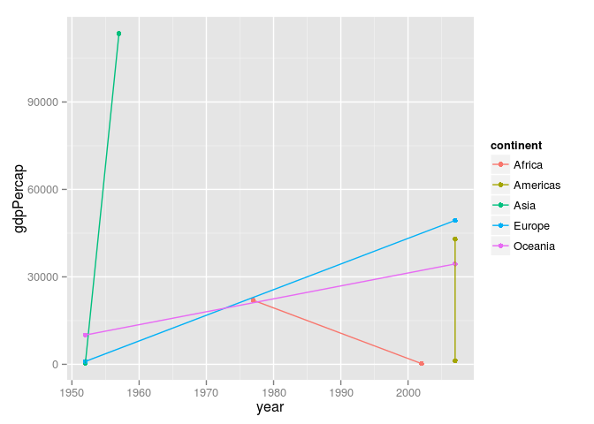
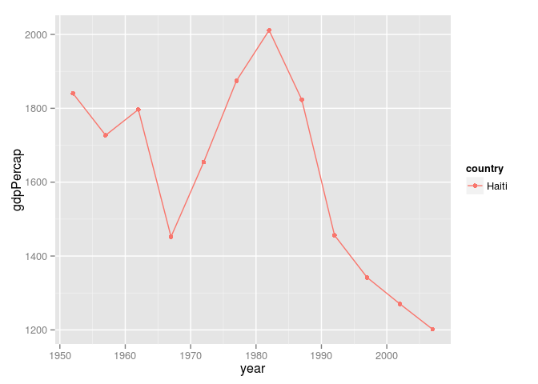
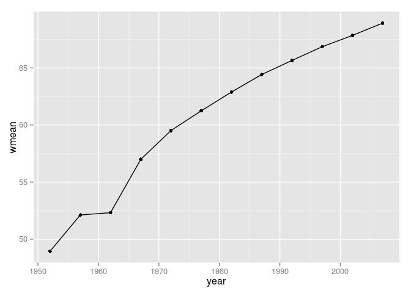
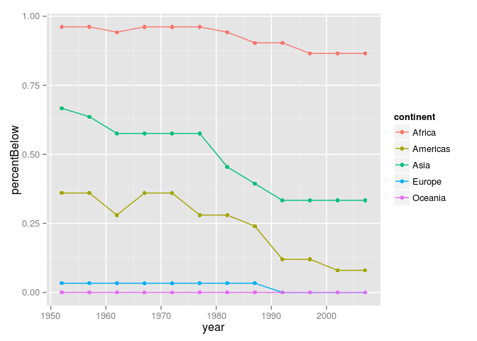

# hw3
Adam Pearce  


Load data from URL

```
## 
## Attaching package: 'dplyr'
## 
## The following object is masked from 'package:stats':
## 
##     filter
## 
## The following objects are masked from 'package:base':
## 
##     intersect, setdiff, setequal, union
```

###Get the maximum and minimum of GDP per capita for all continents.


```r
GDPextent <- gtbl %>%
  select(year, country, continent, gdpPercap) %>%
  arrange(continent, year) %>%
  group_by(continent) %>%
  filter(min_rank(desc(gdpPercap)) < 2 | min_rank(gdpPercap) < 2)

(GDPextent)
```

```
## Source: local data frame [10 x 4]
## Groups: continent
## 
##    year                country continent   gdpPercap
## 1  1977                  Libya    Africa  21951.2118
## 2  2002       Congo, Dem. Rep.    Africa    241.1659
## 3  2007                  Haiti  Americas   1201.6372
## 4  2007          United States  Americas  42951.6531
## 5  1952                Myanmar      Asia    331.0000
## 6  1957                 Kuwait      Asia 113523.1329
## 7  1952 Bosnia and Herzegovina    Europe    973.5332
## 8  2007                 Norway    Europe  49357.1902
## 9  1952              Australia   Oceania  10039.5956
## 10 2007              Australia   Oceania  34435.3674
```

Scatter plot connecting max and min gdpPerCap
 

Haiti has suffered a steep decline
 

###Compute a trimmed mean of life expectancy for different years. Or a weighted mean, weighting by population. Just try something other than the plain vanilla mean.

```r
meanByYear  <- gtbl  %>% 
  group_by(year)  %>%  
  summarise(mean = mean(lifeExp), wmean = weighted.mean(lifeExp, pop))
```


```r
ggplot(meanByYear, aes(x = year, y = wmean)) + geom_point() + geom_line()
```

 

###The determine how many countries on each continent have a life expectancy less than this benchmark, for each year.


```r
gtbl  <-  gtbl %>%
  mutate(bench = meanByYear$wmean[match(year, meanByYear$year)],
        benchDif = lifeExp - bench,
        belowBench = lifeExp < bench)

head(gtbl)
```

```
## Source: local data frame [6 x 9]
## 
##       country year      pop continent lifeExp gdpPercap    bench  benchDif
## 1 Afghanistan 1952  8425333      Asia  28.801  779.4453 48.94424 -20.14324
## 2 Afghanistan 1957  9240934      Asia  30.332  820.8530 52.12189 -21.78989
## 3 Afghanistan 1962 10267083      Asia  31.997  853.1007 52.32438 -20.32738
## 4 Afghanistan 1967 11537966      Asia  34.020  836.1971 56.98431 -22.96431
## 5 Afghanistan 1972 13079460      Asia  36.088  739.9811 59.51478 -23.42678
## 6 Afghanistan 1977 14880372      Asia  38.438  786.1134 61.23726 -22.79926
## Variables not shown: belowBench (lgl)
```

Generate grouped data

```r
byContYear = gtbl  %>% 
    group_by(year, continent)  %>% 
    summarize(n_obs = n(),
              percentBelow = mean(belowBench))
```

Show change over time

```r
ggplot(byContYear, aes(x = year, y = percentBelow, color=continent)) + geom_point() +geom_line()
```

 
