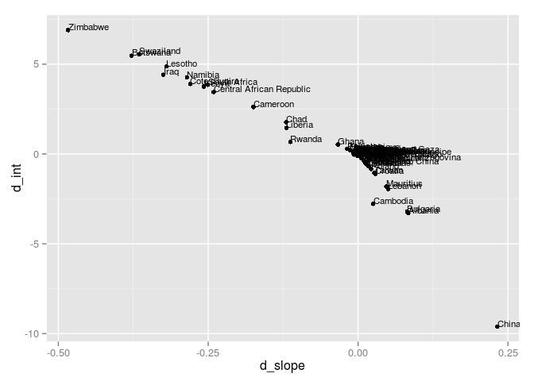
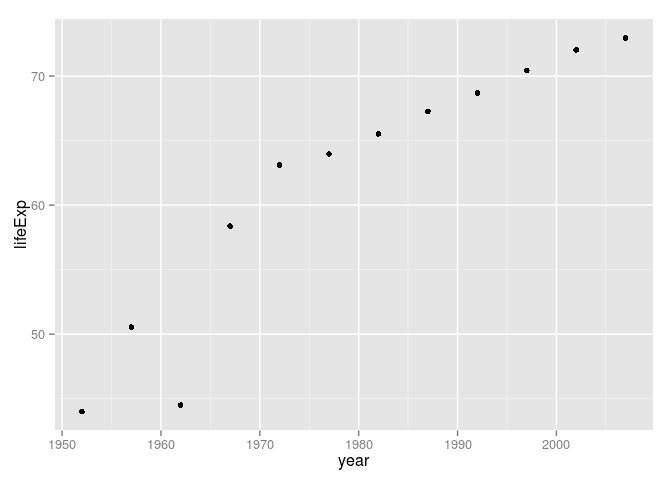

# Functions
Adam Pearce  


```
## 
## Attaching package: 'dplyr'
## 
## The following objects are masked from 'package:plyr':
## 
##     arrange, count, desc, failwith, id, mutate, rename, summarise,
##     summarize
## 
## The following object is masked from 'package:stats':
## 
##     filter
## 
## The following objects are masked from 'package:base':
## 
##     intersect, setdiff, setequal, union
```

Fit a regression using ordinary least squares and a robust technique.


```r
j_coefs <- ddply(gDat, ~ country + continent, function(gDat, offset = 1952) {
  ols <- lm(lifeExp ~ I(year - offset), gDat)
  rbs <- lmrob(lifeExp ~ I(year - offset), gDat, setting = "KS2011")
  ols_coef <- setNames(coef(ols), c("o_int", "o_slope"))
  rbs_coef <- setNames(coef(rbs), c("r_int", "r_slope"))
  dif_coef <- setNames(c(ols_coef[1] - rbs_coef[1], ols_coef[2] - rbs_coef[2]),
                       c("d_int", "d_slope"))
  c(ols_coef, rbs_coef, dif_coef)
})

j_coefs
```

```
##                      country continent    o_int     o_slope    r_int
## 1                Afghanistan      Asia 29.90729  0.27532867 29.89624
## 2                    Albania    Europe 59.22913  0.33468322 62.52708
## 3                    Algeria    Africa 43.37497  0.56927972 43.29400
## 4                     Angola    Africa 32.12665  0.20933986 32.15552
## 5                  Argentina  Americas 62.68844  0.23170839 62.67009
## 6                  Australia   Oceania 68.40051  0.22772378 68.41318
## 7                    Austria    Europe 66.44846  0.24199231 66.44193
## 8                    Bahrain      Asia 52.74921  0.46750769 52.68051
## 9                 Bangladesh      Asia 36.13549  0.49813077 36.14249
## 10                   Belgium    Europe 67.89192  0.20908462 67.92719
## 11                     Benin    Africa 39.58851  0.33423287 39.57126
## 12                   Bolivia  Americas 38.75645  0.49993217 38.77588
## 13    Bosnia and Herzegovina    Europe 58.08956  0.34975524 58.45263
## 14                  Botswana    Africa 52.92912  0.06066853 47.45615
## 15                    Brazil  Americas 51.51204  0.39008951 51.53558
## 16                  Bulgaria    Europe 65.73731  0.14568881 68.94601
## 17              Burkina Faso    Africa 34.68469  0.36397483 34.70164
## 18                   Burundi    Africa 40.57864  0.15413427 40.56657
## 19                  Cambodia      Asia 37.01542  0.39590280 39.78586
## 20                  Cameroon    Africa 41.24946  0.25014685 38.63085
## 21                    Canada  Americas 68.88385  0.21886923 68.88735
## 22  Central African Republic    Africa 38.80951  0.18390559 35.36120
## 23                      Chad    Africa 39.80937  0.25324406 38.04190
## 24                     Chile  Americas 54.31771  0.47684406 54.26788
## 25                     China      Asia 47.19048  0.53071485 56.80777
## 26                  Colombia  Americas 53.42712  0.38075035 54.08238
## 27                   Comoros    Africa 39.99600  0.45039091 39.98258
## 28          Congo, Dem. Rep.    Africa 41.96108  0.09391538 41.93284
## 29               Congo, Rep.    Africa 47.13678  0.19509580 47.20730
## 30                Costa Rica  Americas 59.10471  0.40278951 59.06484
## 31             Cote d'Ivoire    Africa 44.84586  0.13055664 40.94420
## 32                   Croatia    Europe 63.85578  0.22545944 64.96722
## 33                      Cuba  Americas 62.21345  0.32115035 62.29321
## 34            Czech Republic    Europe 67.52808  0.14481538 67.52910
## 35                   Denmark    Europe 71.03359  0.12133007 71.03587
## 36                  Djibouti    Africa 36.27715  0.36740350 36.26711
## 37        Dominican Republic  Americas 48.59781  0.47115245 48.71666
## 38                   Ecuador  Americas 49.06537  0.50005315 48.82961
## 39                     Egypt    Africa 40.96800  0.55545455 40.98735
## 40               El Salvador  Americas 46.51195  0.47714126 46.61183
## 41         Equatorial Guinea    Africa 34.43031  0.31017063 34.42413
## 42                   Eritrea    Africa 35.69527  0.37469021 35.76617
## 43                  Ethiopia    Africa 36.02815  0.30718531 36.18753
## 44                   Finland    Europe 66.44897  0.23792517 66.38748
## 45                    France    Europe 67.79013  0.23850140 67.80404
## 46                     Gabon    Africa 38.93535  0.44673287 38.80260
## 47                    Gambia    Africa 28.40037  0.58182587 28.39776
## 48                   Germany    Europe 67.56813  0.21368322 67.59514
## 49                     Ghana    Africa 43.49274  0.32174266 42.96595
## 50                    Greece    Europe 67.06721  0.24239860 67.09712
## 51                 Guatemala  Americas 42.11940  0.53127343 42.05123
## 52                    Guinea    Africa 31.55699  0.42483077 31.45607
## 53             Guinea-Bissau    Africa 31.73704  0.27175315 31.74996
## 54                     Haiti  Americas 39.24615  0.39705804 39.49479
## 55                  Honduras  Americas 42.99241  0.54285175 42.95836
## 56          Hong Kong, China      Asia 63.42864  0.36597063 64.00789
## 57                   Hungary    Europe 65.99282  0.12364895 66.05916
## 58                   Iceland    Europe 71.96359  0.16537552 71.97365
## 59                     India      Asia 39.26976  0.50532098 39.25036
## 60                 Indonesia      Asia 36.88312  0.63464126 36.85231
## 61                      Iran      Asia 44.97899  0.49663986 44.88852
## 62                      Iraq      Asia 50.11346  0.23521049 45.70503
## 63                   Ireland    Europe 67.54146  0.19911958 67.52971
## 64                    Israel      Asia 66.30041  0.26710629 66.67844
## 65                     Italy    Europe 66.59679  0.26971049 66.52684
## 66                   Jamaica  Americas 62.66099  0.22139441 63.34130
## 67                     Japan      Asia 65.12205  0.35290420 65.16194
## 68                    Jordan      Asia 44.06386  0.57172937 44.00816
## 69                     Kenya    Africa 47.00204  0.20650769 43.24886
## 70          Korea, Dem. Rep.      Asia 54.90560  0.31642657 54.90800
## 71               Korea, Rep.      Asia 49.72750  0.55540000 49.94132
## 72                    Kuwait      Asia 57.45933  0.41683636 57.42121
## 73                   Lebanon      Asia 58.68736  0.26102937 60.64598
## 74                   Lesotho    Africa 47.37903  0.09556573 42.49988
## 75                   Liberia    Africa 39.83642  0.09599371 38.38562
## 76                     Libya    Africa 42.10194  0.62553566 42.05753
## 77                Madagascar    Africa 36.66806  0.40372797 36.70002
## 78                    Malawi    Africa 36.91037  0.23422587 36.84607
## 79                  Malaysia      Asia 51.50522  0.46452238 51.54552
## 80                      Mali    Africa 33.05123  0.37680979 33.06022
## 81                Mauritania    Africa 40.02560  0.44641748 40.02410
## 82                 Mauritius    Africa 55.37077  0.34845385 57.17787
## 83                    Mexico  Americas 53.00537  0.45103497 53.50732
## 84                  Mongolia      Asia 43.82641  0.43868811 43.89358
## 85                Montenegro    Europe 62.24163  0.29300140 62.21692
## 86                   Morocco    Africa 42.69083  0.54247273 42.65247
## 87                Mozambique    Africa 34.20615  0.22448531 33.98636
## 88                   Myanmar      Asia 41.41155  0.43309510 41.62555
## 89                   Namibia    Africa 47.13433  0.23116364 42.86924
## 90                     Nepal      Asia 34.43164  0.52926154 34.28067
## 91               Netherlands    Europe 71.88962  0.13668671 71.98772
## 92               New Zealand   Oceania 68.68692  0.19282098 68.70086
## 93                 Nicaragua  Americas 43.04513  0.55651958 43.03107
## 94                     Niger    Africa 35.15067  0.34210909 35.16434
## 95                   Nigeria    Africa 37.85953  0.20806573 37.85030
## 96                    Norway    Europe 72.21462  0.13194126 72.22514
## 97                      Oman      Asia 37.20774  0.77217902 37.11763
## 98                  Pakistan      Asia 43.72296  0.40579231 43.44062
## 99                    Panama  Americas 58.06100  0.35420909 58.31333
## 100                 Paraguay  Americas 62.48183  0.15735455 62.49022
## 101                     Peru  Americas 44.34764  0.52769790 44.28739
## 102              Philippines      Asia 49.40435  0.42046923 49.93247
## 103                   Poland    Europe 64.78090  0.19621888 65.61052
## 104                 Portugal    Europe 61.14679  0.33720140 61.13683
## 105              Puerto Rico  Americas 66.94853  0.21057483 67.50211
## 106                  Reunion    Africa 53.99754  0.45988042 53.92497
## 107                  Romania    Europe 63.96213  0.15740140 64.33942
## 108                   Rwanda    Africa 42.74195 -0.04583147 42.06375
## 109    Sao Tome and Principe    Africa 48.52756  0.34068252 48.56365
## 110             Saudi Arabia      Asia 40.81412  0.64962308 40.69376
## 111                  Senegal    Africa 36.74667  0.50470000 36.72962
## 112                   Serbia    Europe 61.53435  0.25515105 61.92146
## 113             Sierra Leone    Africa 30.88321  0.21403497 30.86699
## 114                Singapore      Asia 61.84588  0.34088601 62.09137
## 115          Slovak Republic    Europe 67.00987  0.13404406 67.39502
## 116                 Slovenia    Europe 66.08635  0.20052378 66.07570
## 117                  Somalia    Africa 34.67540  0.22957343 34.64691
## 118             South Africa    Africa 49.34128  0.16915944 45.48558
## 119                    Spain    Europe 66.47782  0.28093077 66.51713
## 120                Sri Lanka      Asia 59.79149  0.24489441 60.14732
## 121                    Sudan    Africa 37.87419  0.38277483 37.87264
## 122                Swaziland    Africa 46.38786  0.09507483 40.83098
## 123                   Sweden    Europe 71.60500  0.16625455 71.60745
## 124              Switzerland    Europe 69.45372  0.22223147 69.45706
## 125                    Syria      Asia 46.10128  0.55435944 46.01580
## 126                   Taiwan      Asia 61.33744  0.32724476 62.38391
## 127                 Tanzania    Africa 43.10841  0.17468811 43.09356
## 128                 Thailand      Asia 52.65642  0.34704825 52.69278
## 129                     Togo    Africa 40.97746  0.38259231 40.95818
## 130      Trinidad and Tobago  Americas 62.05231  0.17366154 62.23719
## 131                  Tunisia    Africa 44.55531  0.58784336 44.43363
## 132                   Turkey    Europe 46.02232  0.49723986 46.61362
## 133                   Uganda    Africa 44.27522  0.12158601 44.26881
## 134           United Kingdom    Europe 68.80853  0.18596573 68.80101
## 135            United States  Americas 68.41385  0.18416923 68.42677
## 136                  Uruguay  Americas 65.74160  0.18327203 65.75099
## 137                Venezuela  Americas 57.51332  0.32972168 57.59958
## 138                  Vietnam      Asia 39.01008  0.67161538 39.04186
## 139       West Bank and Gaza      Asia 43.79840  0.60110070 43.71588
## 140              Yemen, Rep.      Asia 30.13028  0.60545944 30.11751
## 141                   Zambia    Africa 47.65803 -0.06042517 47.66305
## 142                 Zimbabwe    Africa 55.22124 -0.09302098 48.32056
##         r_slope        d_int       d_slope
## 1    0.27546545  0.011059181 -1.367826e-04
## 2    0.25092247 -3.297950086  8.376075e-02
## 3    0.57206254  0.080978918 -2.782817e-03
## 4    0.20830461 -0.028868518  1.035250e-03
## 5    0.23224358  0.018347275 -5.351891e-04
## 6    0.22756889 -0.012671809  1.548840e-04
## 7    0.24223757  0.006535432 -2.452599e-04
## 8    0.47122058  0.068693472 -3.712884e-03
## 9    0.49837553 -0.006999346 -2.447589e-04
## 10   0.20856462 -0.035271578  5.200001e-04
## 11   0.33551657  0.017255582 -1.283699e-03
## 12   0.49986390 -0.019435279  6.827035e-05
## 13   0.34009756 -0.363061356  9.657681e-03
## 14   0.43841322  5.472964060 -3.777447e-01
## 15   0.38991433 -0.023540638  1.751824e-04
## 16   0.06370919 -3.208701718  8.197962e-02
## 17   0.36350912 -0.016945806  4.657007e-04
## 18   0.15430982  0.012066550 -1.755535e-04
## 19   0.37057414 -2.770433719  2.532865e-02
## 20   0.42465026  2.618614725 -1.745034e-01
## 21   0.21878360 -0.003501802  8.563127e-05
## 22   0.42478553  3.448315143 -2.408799e-01
## 23   0.37325719  1.767472143 -1.200131e-01
## 24   0.47880330  0.049826010 -1.959242e-03
## 25   0.29841803 -9.617291435  2.322968e-01
## 26   0.36331413 -0.655264524  1.743622e-02
## 27   0.45110975  0.013422094 -7.188388e-04
## 28   0.09500638  0.028241636 -1.090999e-03
## 29   0.19326620 -0.070521964  1.829604e-03
## 30   0.40479671  0.039861851 -2.007197e-03
## 31   0.41044037  3.901663254 -2.798837e-01
## 32   0.19652811 -1.111442872  2.893133e-02
## 33   0.31886529 -0.079764805  2.285060e-03
## 34   0.14478996 -0.001026784  2.541995e-05
## 35   0.12094856 -0.002276057  3.815056e-04
## 36   0.36813853  0.010040403 -7.350332e-04
## 37   0.46870068 -0.118852773  2.451772e-03
## 38   0.51394291  0.235764479 -1.388977e-02
## 39   0.55543884 -0.019348418  1.570455e-05
## 40   0.47828822 -0.099881845 -1.146966e-03
## 41   0.30984529  0.006176746  3.253372e-04
## 42   0.37603824 -0.070903909 -1.348026e-03
## 43   0.30289299 -0.159377260  4.292325e-03
## 44   0.23721357  0.061494808  7.116055e-04
## 45   0.23812441 -0.013912662  3.769872e-04
## 46   0.45396850  0.132749804 -7.235635e-03
## 47   0.58206928  0.002607895 -2.434063e-04
## 48   0.21332970 -0.027013385  3.535119e-04
## 49   0.35546151  0.526798000 -3.371885e-02
## 50   0.24148993 -0.029912205  9.086670e-04
## 51   0.53423891  0.068167329 -2.965488e-03
## 52   0.42750762  0.100918181 -2.676855e-03
## 53   0.27150856 -0.012922830  2.445883e-04
## 54   0.39059637 -0.248631729  6.461675e-03
## 55   0.54439651  0.034052392 -1.544760e-03
## 56   0.35088768 -0.579250253  1.508295e-02
## 57   0.12224948 -0.066342106  1.399466e-03
## 58   0.16515317 -0.010061096  2.223531e-04
## 59   0.50599579  0.019395904 -6.748123e-04
## 60   0.63612179  0.030809756 -1.480528e-03
## 61   0.50200608  0.090466233 -5.366216e-03
## 62   0.55999575  4.408430014 -3.247853e-01
## 63   0.19936689  0.011751525 -2.473119e-04
## 64   0.25723474 -0.378029867  9.871558e-03
## 65   0.27477474  0.069954655 -5.064251e-03
## 66   0.20366022 -0.680310106  1.773419e-02
## 67   0.35225410 -0.039892012  6.500948e-04
## 68   0.57390988  0.055695590 -2.180510e-03
## 69   0.46374261  3.753178767 -2.572349e-01
## 70   0.31659051 -0.002400061 -1.639375e-04
## 71   0.54999197 -0.213820057  5.408033e-03
## 72   0.41905796  0.038121126 -2.221598e-03
## 73   0.21079522 -1.958617108  5.023415e-02
## 74   0.41521033  4.879147279 -3.196446e-01
## 75   0.21551668  1.450802537 -1.195230e-01
## 76   0.62790355  0.044402282 -2.367882e-03
## 77   0.41062341 -0.031958365 -6.895436e-03
## 78   0.23793376  0.064297664 -3.707889e-03
## 79   0.46378763 -0.040299238  7.347461e-04
## 80   0.37656386 -0.008989171  2.459329e-04
## 81   0.44645588  0.001502894 -3.839624e-05
## 82   0.30137896 -1.807097999  4.707489e-02
## 83   0.43877954 -0.501952319  1.225542e-02
## 84   0.43696454 -0.067167417  1.723571e-03
## 85   0.29418450  0.024709569 -1.183097e-03
## 86   0.54462210  0.038368165 -2.149375e-03
## 87   0.23812315  0.219789619 -1.363784e-02
## 88   0.42730456 -0.214001824  5.790540e-03
## 89   0.51645413  4.265089391 -2.852905e-01
## 90   0.53308048  0.150968403 -3.818938e-03
## 91   0.13518748 -0.098099744  1.499233e-03
## 92   0.19282288 -0.013934606 -1.897101e-06
## 93   0.55678246  0.014059959 -2.628757e-04
## 94   0.34158434 -0.013670213  5.247536e-04
## 95   0.20861914  0.009223369 -5.534021e-04
## 96   0.13206524 -0.010528188 -1.239770e-04
## 97   0.77655534  0.090116768 -4.376315e-03
## 98   0.42370508  0.282339904 -1.791277e-02
## 99   0.34781065 -0.252327775  6.398438e-03
## 100  0.15711338 -0.008382019  2.411672e-04
## 101  0.53124278  0.060250476 -3.544875e-03
## 102  0.40668615 -0.528120536  1.378309e-02
## 103  0.17455690 -0.829618315  2.166198e-02
## 104  0.33765600  0.009965541 -4.546020e-04
## 105  0.19643381 -0.553584409  1.414101e-02
## 106  0.46402996  0.072564910 -4.149539e-03
## 107  0.14738409 -0.377286877  1.001731e-02
## 108  0.06695132  0.678200655 -1.127828e-01
## 109  0.33982783 -0.036084665  8.546913e-04
## 110  0.65626028  0.120351089 -6.637200e-03
## 111  0.50535008  0.017051597 -6.500808e-04
## 112  0.24490491 -0.387117758  1.024614e-02
## 113  0.21319085  0.016218355  8.441103e-04
## 114  0.33443530 -0.245486056  6.450710e-03
## 115  0.12374782 -0.385151881  1.029623e-02
## 116  0.20089651  0.010643149 -3.727298e-04
## 117  0.23734290  0.028488056 -7.769470e-03
## 118  0.41977906  3.855703970 -2.506196e-01
## 119  0.27978837 -0.039313403  1.142401e-03
## 120  0.23524933 -0.355837070  9.645075e-03
## 121  0.38267095  0.001550762  1.038776e-04
## 122  0.46007895  5.556875992 -3.650041e-01
## 123  0.16618207 -0.002446171  7.247323e-05
## 124  0.22212507 -0.003345019  1.064006e-04
## 125  0.55911013  0.085480045 -4.750685e-03
## 126  0.30001337 -1.046470929  2.723138e-02
## 127  0.17514901  0.014845617 -4.609018e-04
## 128  0.34608183 -0.036357360  9.664205e-04
## 129  0.38369672  0.019283311 -1.104411e-03
## 130  0.16882458 -0.184879896  4.836961e-03
## 131  0.59500735  0.121679534 -7.163990e-03
## 132  0.48221122 -0.591301594  1.502864e-02
## 133  0.12351731  0.006406379 -1.931291e-03
## 134  0.18626352  0.007511695 -2.977809e-04
## 135  0.18382035 -0.012922602  3.488806e-04
## 136  0.18321047 -0.009386295  6.156027e-05
## 137  0.32762070 -0.086255599  2.100979e-03
## 138  0.67118238 -0.031785698  4.330085e-04
## 139  0.60578068  0.082518991 -4.679978e-03
## 140  0.60617554  0.012771060 -7.161021e-04
## 141 -0.06084354 -0.005023308  4.183668e-04
## 142  0.39074448  6.900679172 -4.837655e-01
```

Plot the difference in estimated parameters under the two approaches

```r
p  <- ggplot(j_coefs, aes(x = d_slope, y = d_int, label = country)) + geom_point()
p + geom_text(hjust=0, vjust=0, size=3)
```

 

China and Zimbabwe are the biggest outliers.


```r
j_coefs  %>% filter(country == 'China')
```

```
##   country continent    o_int   o_slope    r_int  r_slope     d_int
## 1   China      Asia 47.19048 0.5307149 56.80777 0.298418 -9.617291
##     d_slope
## 1 0.2322968
```

The robust regression throws out some of the post WWII and great leap forward years

```r
gDat  %>% filter(country == 'China')
```

```
##    country year        pop continent  lifeExp gdpPercap
## 1    China 1952  556263528      Asia 44.00000  400.4486
## 2    China 1957  637408000      Asia 50.54896  575.9870
## 3    China 1962  665770000      Asia 44.50136  487.6740
## 4    China 1967  754550000      Asia 58.38112  612.7057
## 5    China 1972  862030000      Asia 63.11888  676.9001
## 6    China 1977  943455000      Asia 63.96736  741.2375
## 7    China 1982 1000281000      Asia 65.52500  962.4214
## 8    China 1987 1084035000      Asia 67.27400 1378.9040
## 9    China 1992 1164970000      Asia 68.69000 1655.7842
## 10   China 1997 1230075000      Asia 70.42600 2289.2341
## 11   China 2002 1280400000      Asia 72.02800 3119.2809
## 12   China 2007 1318683096      Asia 72.96100 4959.1149
```

```r
ggplot(gDat  %>% subset(country == 'China'), aes(x = year, y=lifeExp)) + geom_point()
```

 


Color dots by weight of robust regression?


