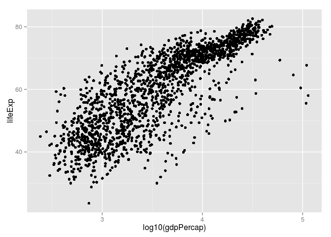

# Gap exploration
Adam Pearce  

Load data from URL

```r
gdURL  <-  "http://tiny.cc/gapminder"
gDat  <- read.delim(file = gdURL)
head(gDat)
```

```
##       country year      pop continent lifeExp gdpPercap
## 1 Afghanistan 1952  8425333      Asia  28.801  779.4453
## 2 Afghanistan 1957  9240934      Asia  30.332  820.8530
## 3 Afghanistan 1962 10267083      Asia  31.997  853.1007
## 4 Afghanistan 1967 11537966      Asia  34.020  836.1971
## 5 Afghanistan 1972 13079460      Asia  36.088  739.9811
## 6 Afghanistan 1977 14880372      Asia  38.438  786.1134
```

Load ggplot2

```r
library(ggplot2)
```

 

