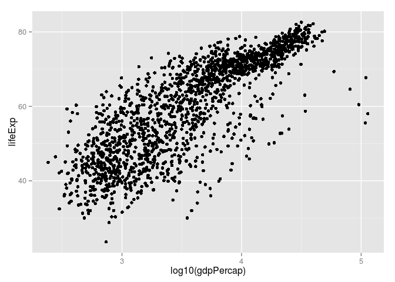
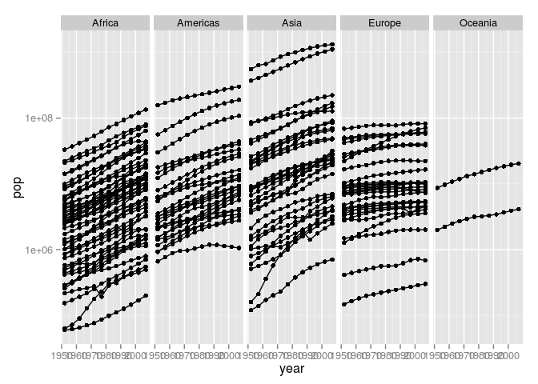

# Gap exploration
Adam Pearce  


Load data from URL

```r
gdURL  <-  "http://tiny.cc/gapminder"
gDat  <- read.delim(file = gdURL)
```

read.delim creates a dataframe

```r
class(gDat)
```

```
## [1] "data.frame"
```

There are 1704 rows

```r
summary(gDat)
```

```
##         country          year           pop               continent  
##  Afghanistan:  12   Min.   :1952   Min.   :6.001e+04   Africa  :624  
##  Albania    :  12   1st Qu.:1966   1st Qu.:2.794e+06   Americas:300  
##  Algeria    :  12   Median :1980   Median :7.024e+06   Asia    :396  
##  Angola     :  12   Mean   :1980   Mean   :2.960e+07   Europe  :360  
##  Argentina  :  12   3rd Qu.:1993   3rd Qu.:1.959e+07   Oceania : 24  
##  Australia  :  12   Max.   :2007   Max.   :1.319e+09                 
##  (Other)    :1632                                                    
##     lifeExp        gdpPercap       
##  Min.   :23.60   Min.   :   241.2  
##  1st Qu.:48.20   1st Qu.:  1202.1  
##  Median :60.71   Median :  3531.8  
##  Mean   :59.47   Mean   :  7215.3  
##  3rd Qu.:70.85   3rd Qu.:  9325.5  
##  Max.   :82.60   Max.   :113523.1  
## 
```

nrow only gets the number of rows

```r
nrow(gDat)
```

```
## [1] 1704
```

column flavors

```r
class(gDat$year)
```

```
## [1] "integer"
```

```r
class(gDat$country)
```

```
## [1] "factor"
```

```r
class(gDat$pop)
```

```
## [1] "numeric"
```

```r
class(gDat$continent)
```

```
## [1] "factor"
```

```r
class(gDat$gdpPercap)
```

```
## [1] "numeric"
```

Load ggplot2

```r
library(ggplot2)
```

 

Every countries growth rate

```r
ggplot(gDat, aes(x = year, y = pop)) + geom_point() + scale_y_log10() + facet_grid(~ continent) + geom_line(aes(group = country))
```

 
